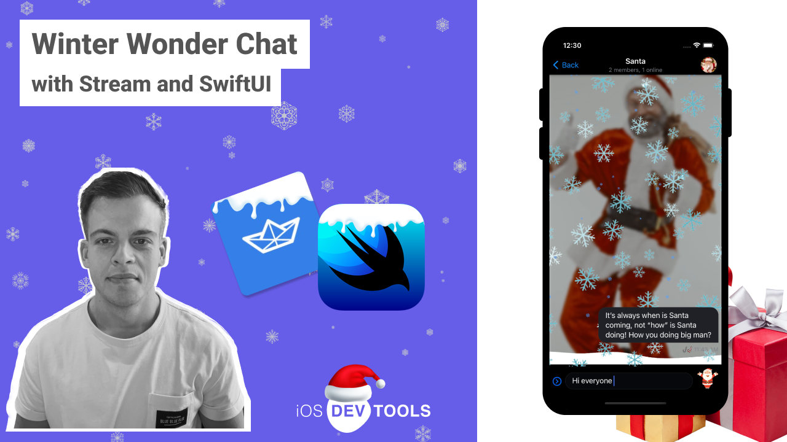

# Winter Wonder Chat using SwiftUI and Stream

This repository contains the code for our tutorial on how to Christmas theme your Stream Chat. 

### In this tutorial we cover
  - How to setup a Stream Chat in SwiftUI
  - How to use the [Stream Chat Effects library for SwiftUI](https://github.com/GetStream/effects-library) and add snow to your app
  - How to theme your chat application using a ViewFactory

## View our full video tutorial
[Link to the video](https://youtu.be/7btMvZcBpJI)

